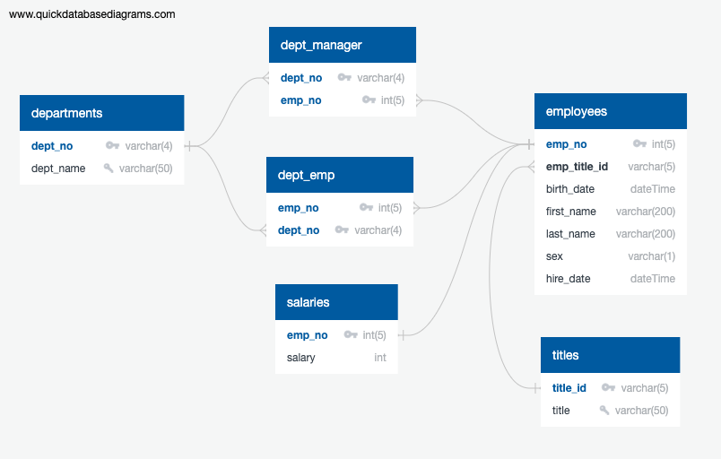

# SQL Challenge

**Student name:** Tania Barrera

---

- [Background](#background)
- [Instructions and Summary of Results](#instructions-and-summary-of-results)
  - [Data Modeling (10 points)](#data-modeling-10-points)
    - [Modeling Results](#modeling-results)
  - [Data Engineering (70 points)](#data-engineering-70-points)
    - [Engineering Results](#engineering-results)
  - [Data Analysis (20 points)](#data-analysis-20-points)
    - [Analysis Results](#analysis-results)
- [References](#references)

---

This repo contains my work for the challenge that corresponds to Module 9 of the UofT SCS edX Data Bootcamp.

---

## Background

It’s been two weeks since you were hired as a new data engineer at Pewlett Hackard (a fictional company). Your first major task is to do a research project about people whom the company employed during the 1980s and 1990s. All that remains of the employee database from that period are six CSV files.

For this project, you’ll design the tables to hold the data from the CSV files, import the CSV files into a SQL database, and then answer questions about the data. That is, you’ll perform data modeling, data engineering, and data analysis, respectively.

## Instructions and Summary of Results

This Challenge is divided into three parts: data modeling, data engineering, and data analysis. Each part's results are in a separate folder within the EmployeeSQL folder.

### Data Modeling (10 points)

Inspect the CSV files, and then sketch an Entity Relationship Diagram of the tables. To create the sketch, feel free to use a tool like QuickDBD.

#### Modeling Results

Entity Relationshop Diagram:

Detailed documentation is also included as a pdf [here](EmployeeSQL/1_modeling/QuickDBD-EmployeeSQL.pdf).

### Data Engineering (70 points)

1. Use the provided information to create a table schema for each of the six CSV files. Be sure to do the following:

    - Remember to specify the data types, primary keys, foreign keys, and other constraints.

    - For the primary keys, verify that the column is unique. Otherwise, create a composite key, which takes two primary keys to uniquely identify a row.

    - Be sure to create the tables in the correct order to handle the foreign keys.

2. Import each CSV file into its corresponding SQL table.

#### Engineering Results

The schema is included in this file: [EmployeeSQL/2_engineering/schema.sql](EmployeeSQL/2_engineering/schema.sql)

Here, I defined each of the six tables, including:
- All required columns
- Data type for each column, including relevant value lengths for those of type `VARCHAR`. Note that dates are defined as Date type. 
- Unique primary keys, as well as including `UNIQUE` constraints when relevant (i.e. title and department names)
- Foreign keys and to what table they are related.
- When necessary, the `NOT NULL` condition is set, to avoid data errors.

The tables are defined in the following order, to avoid errors related to referenced tables and foreign keys: (1) departments, (2) titles, (3) employees, (4) dept_emp, (5) dept_manager, (6) salaries. This is also the order in which the data is inputted into the database.

### Data Analysis (20 points)

1. List the employee number, last name, first name, sex, and salary of each employee (2 points).

2. List the first name, last name, and hire date for the employees who were hired in 1986 (2 points).

3. List the manager of each department along with their department number, department name, employee number, last name, and first name (2 points).

4. List the department number for each employee along with that employee’s employee number, last name, first name, and department name (2 points).

5. List first name, last name, and sex of each employee whose first name is Hercules and whose last name begins with the letter B (2 points).

6. List each employee in the Sales department, including their employee number, last name, and first name (2 points).

7. List each employee in the Sales and Development departments, including their employee number, last name, first name, and department name (4 points).

8. List the frequency counts, in descending order, of all the employee last names (that is, how many employees share each last name) (4 points).

#### Analysis Results

All eight queries are included in the file: [EmployeeSQL/3_analysis/queries.sql](EmployeeSQL/3_analysis/queries.sql)

They were all tested with the provided data to ensure correct results.

---

## References

Challenge instructions and input data files, as well as some code sections that were adapted from the UofT SCS EdX Data Bootcamp class activities:

© 2022 edX Boot Camps LLC. Confidential and Proprietary. All Rights Reserved.

Data generated by [Mockaroo, LLC](https://mockaroo.com/), (2022). Realistic Data Generator.

Some other code sections were adapted from other sources, specific explanations are found within the code comments:

| Purpose | Link |
| :- | :- |
| How to get year from date type in Postgresql | [Link](https://www.prisma.io/dataguide/postgresql/date-types) |
